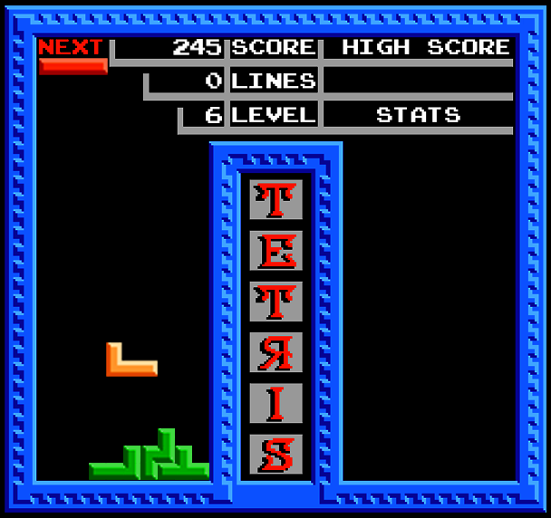

# Tetris JS

Browser version of the known "Tetris Tengen" game.
Project has been created for educational purposes.

## Goal of the project

The goal of the project was to create browser based version of the known "Tetris Tengen" game available for NES console.
Gameplay and scores system have been created based on observations from the original game. For purposes of the project, it has been created only single mode.
The logic of the game has been programmed in JavaScript language.

Graphics has been created based on materials available at: https://www.spriters-resource.com/nes/tetristhesovietmindgametengen/sheet/16022/

Music and sounds have been found at different sources, mainly from the Internet.

---

# [PL]
Przeglądarkowa wersja znanej gry "Tetris Tengen".
Projekt został stworzony wyłącznie w celach edukacyjnych.

## Cel projektu
Celem było odtworzenie popularnej gry "Tetris Tengen" dostępnej na konsole NES w formie gry przeglądarkowej.
Została odtworzona mechanika gry oraz system punktacji. Na potrzeby tego projektu został odtworzony tylko tryb singleplayer.
Logika gry została oprogramowana w języku JavaSctipt.

---

Grafika została wykonana na podstawie materiałów dostępnych pod adresem https://www.spriters-resource.com/nes/tetristhesovietmindgametengen/sheet/16022/

Muzyka oraz dźwięki pochodzą z różnych źródeł, głównie z Internetu.